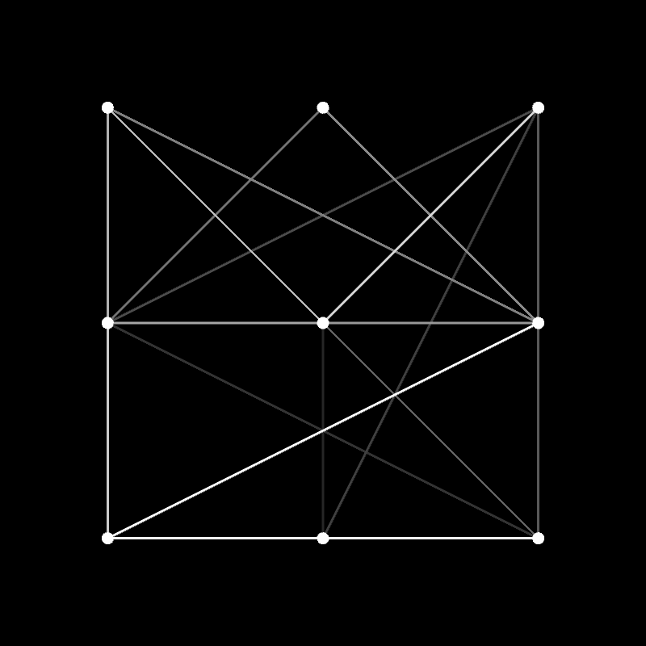
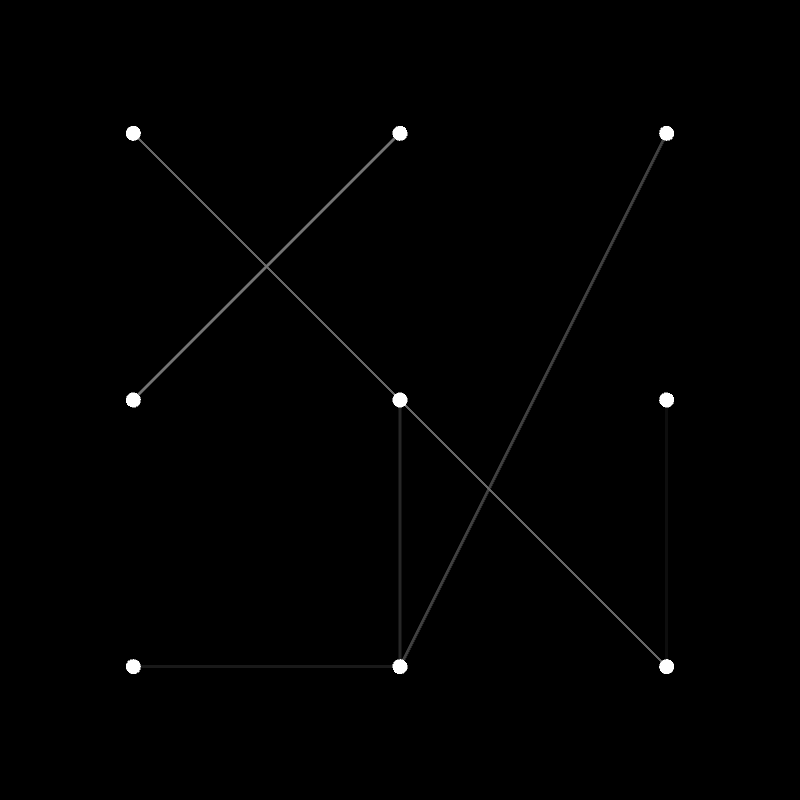

# ЛАБА 2 (СИКВЕЛ)

* Требования: OpenGL 4.3+, GLEW, SFML (нужен только для создания окна, куда будет выводиться картинка)

Итак, каждое ребро имеет вес, принадлежащий отрезку [0.0, 1.0]. 0.0 - черный цвет, 1.0 - белый, другие значения is clamped and interpolated.

Все узлы белого цвета, их видно на картинке.

По итогу должны остаться более-менее черные ребра (что и наблюдается)

До:

После:

